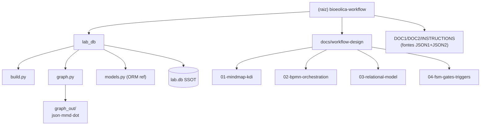

<!-- gitnexus:start -->
# GitNexus — Code Intelligence

This project is indexed by GitNexus as **bioeolica-workflow** (662 symbols, 999 relationships, 25 execution flows). Use the GitNexus MCP tools to understand code, assess impact, and navigate safely.

> Index stale? Run `node .gitnexus/run.cjs analyze` from the project root — it auto-selects an available runner. No `.gitnexus/run.cjs` yet? `npx gitnexus analyze` (npm 11 crash → `npm i -g gitnexus`; #1939).

## Always Do

- **MUST run impact analysis before editing any symbol.** Before modifying a function, class, or method, run `impact({target: "symbolName", direction: "upstream"})` and report the blast radius (direct callers, affected processes, risk level) to the user.
- **MUST run `detect_changes()` before committing** to verify your changes only affect expected symbols and execution flows. For regression review, compare against the default branch: `detect_changes({scope: "compare", base_ref: "main"})`.
- **MUST warn the user** if impact analysis returns HIGH or CRITICAL risk before proceeding with edits.
- When exploring unfamiliar code, use `query({search_query: "concept"})` to find execution flows instead of grepping. It returns process-grouped results ranked by relevance.
- When you need full context on a specific symbol — callers, callees, which execution flows it participates in — use `context({name: "symbolName"})`.
- For security review, `explain({target: "fileOrSymbol"})` lists taint findings (source→sink flows; needs `analyze --pdg`).

## Never Do

- NEVER edit a function, class, or method without first running `impact` on it.
- NEVER ignore HIGH or CRITICAL risk warnings from impact analysis.
- NEVER rename symbols with find-and-replace — use `rename` which understands the call graph.
- NEVER commit changes without running `detect_changes()` to check affected scope.

## Resources

| Resource | Use for |
|----------|---------|
| `gitnexus://repo/bioeolica-workflow/context` | Codebase overview, check index freshness |
| `gitnexus://repo/bioeolica-workflow/clusters` | All functional areas |
| `gitnexus://repo/bioeolica-workflow/processes` | All execution flows |
| `gitnexus://repo/bioeolica-workflow/process/{name}` | Step-by-step execution trace |

## CLI

| Task | Read this skill file |
|------|---------------------|
| Understand architecture / "How does X work?" | `.claude/skills/gitnexus/gitnexus-exploring/SKILL.md` |
| Blast radius / "What breaks if I change X?" | `.claude/skills/gitnexus/gitnexus-impact-analysis/SKILL.md` |
| Trace bugs / "Why is X failing?" | `.claude/skills/gitnexus/gitnexus-debugging/SKILL.md` |
| Rename / extract / split / refactor | `.claude/skills/gitnexus/gitnexus-refactoring/SKILL.md` |
| Tools, resources, schema reference | `.claude/skills/gitnexus/gitnexus-guide/SKILL.md` |
| Index, status, clean, wiki CLI commands | `.claude/skills/gitnexus/gitnexus-cli/SKILL.md` |

<!-- gitnexus:end -->

---

# bioeolica-workflow — Plataforma de Laboratório Computacional

## Visão do Projeto

Laboratório computacional **genérico** para pesquisa multidisciplinar: simulação via FEM/CFD/etc. com workflow multi-agente dinâmico. O engine **Omnibus v3.0-unified** (KDI agent `mech-electro-materials-scientist`) é **produto-agnóstico por construção** — aplica-se a qualquer produto de engenharia (turbina eólica, compressor de H₂, motor-gerador, vaso de pressão, etc.) trocando apenas o **conteúdo** dos domínios; o **caminho** (filosofia → KDI → métodos → domínios → mandatos → fluxo → métricas → WAL) é invariante.

- **SSOT**: `lab.db` — sqlite3 da biblioteca padrão (zero dependências PyPI), roda em ambientes sem acesso à rede.
- **Mandato no-hardcoded**: todos os valores de domínio/método/gate/métrica/regra vivem como **linhas de DB** (ou futuro DMN/objeto), nunca como literais em código.
- **10 domínios = SEED** (não enumeração fechada); a cardinalidade real do time é **derivada em runtime** por KDI + 5W1H + Ishikawa, decidida no gate G1.

## Arquitetura Total (8 partes invariantes)

```
Filosofia (P1-P10, THE-WAY-BY-CONTENT) → KDI (identity + capabilities) → Métodos numéricos
(decision-tree FEM/MPM/SPH/DEM/Peridynamics/ROM/PINNs/híbridos) → Domínios (10 seed, context-dependent)
→ Mandatos M1-M7 → Fluxo F1-F7 (gates G0-G5) → Métricas D1-D10 → WAL (5W1H append-only)
```

- **M³**: Macro (ambiente externo) / Meso (fronteira/interface) / Micro (interior/componente).
- **VVV**: Verificação (G2) + Validação (G3) + Validada (G4) — gate triplo por mandato M3.
- **Decision-tree de método**: binária, por deformação × continuidade × malha (fonte do DMN `dmn_method_selection`).

## Estrutura de Módulos (Mermaid)



### Índice de Módulos

| Módulo | Caminho | Linguagem | Responsabilidade |
|--------|---------|-----------|------------------|
| **lab_db** | `lab_db/` | Python 3 (sqlite3 stdlib) | SSOT relacional integrado JSON1+JSON2; gera knowledge graph data-driven |
| **workflow-design** | `docs/workflow-design/` | Markdown + Mermaid + BPMN XML | Artefatos de design 01-04 (mindmap, BPMN, modelo relacional, FSM) |
| *(fontes)* | raiz | Markdown | `DOC1` (JSON1-KDI), `DOC2` (JSON2-Kaizen), `INSTRUCTIONS` (governança) |

## Execução e Desenvolvimento

```bash
# Ambiente (direnv ativado por .envrc)
source .venv/bin/activate      # Python 3.14

# Construir o DB SSOT (carrega JSON1 + JSON2, roda Q1-Q6)
python3 -m lab_db.build         # -> lab.db

# Derivar o knowledge graph data-driven do DB
python3 -m lab_db.graph         # -> lab_db/graph_out/{graph.json,graph.mmd,graph.dot}
```

> **Sem dependências externas para o core**: `build.py`/`graph.py` usam apenas `sqlite3`, `json`, `os` (stdlib). `models.py` importa `sqlalchemy` (referência ORM para migração futura 1:1 para PostgreSQL+pgvector) — **não é exigido para rodar o DB**.

## Estratégia de Testes

- **Status atual**: sem suíte `tests/` automatizada (gap registrado em `.claude/index.json`).
- **Cobertura indireta**: `lab_db/build.py` executa queries Q1-Q6 que validam relacionalmente o schema pós-seed (saída em stdout).
- **Próximo passo recomendado**: criar `tests/` com `pytest` cobrindo (a) invariantes do schema (FKs, unicidade de `domain_catalog.name`), (b) Q1-Q6, (c) nós/arestas mínimos do `graph.py`.
- Mandato **M3 (VVV)** exige verificação + validação; a ausência de testes formais é uma dívida técnica explícita.

## Padrões de Codificação

1. **ZERO hardcoded de domínio** — qualquer novo domínio/método/gate/métrica/regra = nova linha em DB, nunca literal em código (`models.py`/`build.py` são apenas o "motor fino").
2. **Espelhamento schema** — DDL em `build.py` (sqlite3) e ORM em `models.py` (SQLAlchemy) **devem permanecer 1:1**; migrar um exige migrar o outro.
3. **SQLite stdlib first** — o pipeline offline (`build`, `graph`) não pode depender de PyPI.
4. **WAL append-only** — `wal_log` é só-escrita incremental; nunca UPDATE/DELETE de entradas existentes.
5. **Domínios runtime** — inseridos em `domain_catalog` com `is_seed=0` quando derivados do contexto (não novos SEEDs).

## Diretrizes para IA (uso)

- Para entender **como o engine funciona end-to-end**: leia `docs/workflow-design/04-fsm-gates-triggers.md` (estados F1-F7, gates G0-G5, triggers BPMN, transições explícitas).
- Para entender o **modelo de dados**: leia `docs/workflow-design/03-relational-model-json1-json2.md` (schema SSOT, retificação "domínios context-dependent").
- Para **orquestração multi-agente**: leia `docs/workflow-design/02-bpmn-orchestration.md` (swimlanes Orquestrador/Team/VVV/Memória).
- Para a **topologia do KDI**: leia `docs/workflow-design/01-mindmap-kdi.md`.
- **Antes de editar símbolos Python** (`build.py`, `graph.py`, `models.py`): siga as regras GitNexus no topo deste arquivo (`impact` → editar → `detect_changes`).
- **Nunca** adicione um domínio/método/gate/métrica como literal — sempre como linha de `lab.db` (via `build.py`).

## Changelog

| Data | Ação |
|------|------|
| 2026-06-28T02:32Z | Inicialização do arquiteto: seção estrutural adicionada ao `CLAUDE.md` (preservando bloco GitNexus); `lab_db/CLAUDE.md` e `docs/workflow-design/CLAUDE.md` criados; `.claude/index.json` gerado. |
