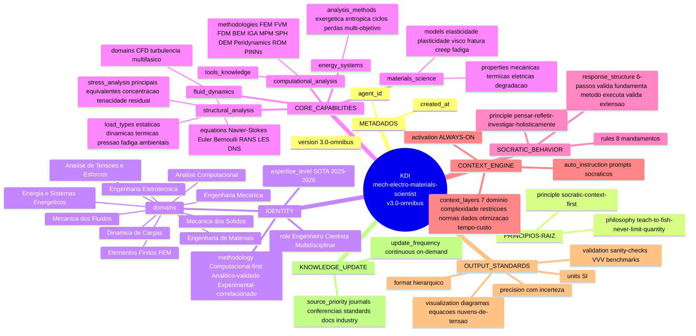

# 01 — Mindmap do Primeiro JSON (KDI — Engine Omnibus v3.0)

**Fonte:** `DOC1-KDI_MECH-ELECTRO-MATERIALS.md` (raiz `agent_id: mech-electro-materials-scientist`, `version: 3.0-omnibus`), consolidado pela visão Kaizen de `DOC2-KAIZEN.md` e pelo mandato de governança em `INSTRUCTIONS.md`.

**Finalidade:** representar a **topologia hierárquica** do objeto KDI e mapear **cada ramo a um Objeto de Engenharia de Contexto** (Projeto, Agente, Objetivo, Task, Domínio, Requisitos, Metodologia) — base sobre a qual o Orquestrador compõe o time dinamicamente.

---

## A) Mindmap hierárquico (topologia do JSON)



---

## B) Mapeamento: ramo do JSON → Objeto de Engenharia de Contexto

Este mapeamento é o que o **Orquestrador** usa para instanciar o time: cada objeto de contexto vira um **papel/escopo** atribuído a um agente especialista.

| Objeto de Contexto (Eng.) | Origem no JSON (DOC1/DOC2) | Função no Workflow | Exemplo concreto |
|---|---|---|---|
| **PROJETO** (escopo global) | `agent_id`, `version`, mandato de governança (INSTRUCTIONS.md §1) | Objetivo global ao qual **todos** os agentes se integram | "Analisar viabilidade mecânica/fluídica do gerador eólico X" |
| **AGENTE** (papel) | `identity.role` + `identity.expertise_level` | Instância de especialista por domínio (1 agente por domínio relevante) | "Eng. de Fluidos", "Eng. de Materiais" |
| **OBJETIVO** (intenção) | `principle`, `philosophy`, `socratic_behavior.principle` | O "porquê" — socrático, ensinar-a-pescar, exaustão holística | "Determinar coef. de segurança sob vento extremo" |
| **TASK** (ação) | `socratic_behavior.response_structure` (6 passos) + `core_capabilities` | O "o quê/como" executar — análise computacional guiada | "CFD da pá + FEM da estrutura" |
| **DOMÍNIO** (área técnica) | `identity.domains` (10) + DOC2 Parte 4 (10 domínios com `relevance_check`) | Critério de **composição do time**: 1 agente por domínio relevante | fluidos, mecânica, materiais, energia, eletricidade... |
| **REQUISITOS** (restrições/qualidade) | `output_standards`, `context_engine.context_layers`, DOC2 Parte 7 (10 métricas) | Gates de aceitação, normas, incerteza, cobertura 75–90% | ISO/ASME, precisão <5%, convergência <1% |
| **METODOLOGIA** (caminho) | `identity.methodology`, DOC2 Parte 3 (decision-tree métodos), M³ (Macro-Meso-Micro) | Como o agente aborda a task — método numérico + escala | "FEM p/ pequena deformação; MPM p/ grande" |
| **CONTEXTO DE ENTRADA** (gatilho) | `context_engine.auto_instruction.prompts`, 5W1H | Enunciado que o orquestrador lê para decompor | Descrição do produto + ambiente + cargas |
| **VALIDAÇÃO (VVV)** | DOC2 Mandato M3 + Parte 7 D3 | Verificação + Validação + Validada — gates do processo | benchmark, solução analítica, cross-code |
| **MEMÓRIA (WAL/SSOT/RAG)** | DOC2 Partes 5 (M4,M5,M6) e 8 (WAL) | Persistência, rastreabilidade, conhecimento reusável | Log 5W1H, Mapa Único, índice RAG |

---

## C) Hierarquia topológica (pai → filho)

```
KDI (raiz)
├── METADADOS               → identifica PROJETO/AGENTE
├── PRINCIPIOS-RAIZ         → OBJETIVO (intenção filosófica)
├── IDENTITY
│   ├── role / expertise    → AGENTE (papel)
│   ├── methodology         → METODOLOGIA (caminho)
│   └── domains[10]         → DOMÍNIO (critério de composição do time)
├── CORE_CAPABILITIES       → TASK (o que cada domínio executa)
│   ├── computational_analysis  (ferramentas + métodos numéricos)
│   ├── fluid_dynamics
│   ├── materials_science
│   ├── structural_analysis
│   └── energy_systems
├── SOCRATIC_BEHAVIOR       → METODOLOGIA (como raciocinar/responder)
├── CONTEXT_ENGINE          → CONTEXTO DE ENTRADA (gatilho + camadas)
├── OUTPUT_STANDARDS        → REQUISITOS (qualidade/saída)
└── KNOWLEDGE_UPDATE        → MEMÓRIA/RAG (fontes priorizadas)
```

**Leitura topológica chave:** `identity.domains[]` é o **eixo de composição do time** — cada domínio relevante vira um agente especialista. As `core_capabilities` dizem **o que** esse agente faz; `socratic_behavior` + `methodology` dizem **como**; `output_standards`/VVV dizem **quando está aceito**; `knowledge_update`/WAL dizem **como persiste**.
