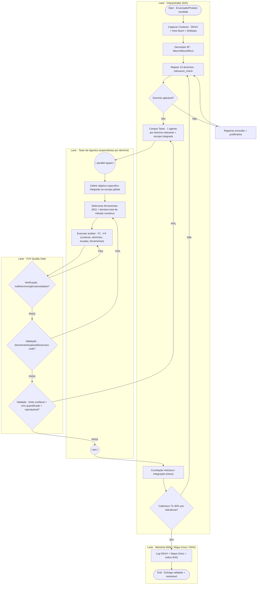

# 02 — BPMN da Orquestração (Engine Omnibus v3.0 → Workflow Multi-Agente)

**Fonte:** DOC2-KAIZEN Partes 5 (Mandatos), 6 (Fluxo F1–F7), 7 (Métricas/VVV), 8 (WAL) + mandato de governança em INSTRUCTIONS.md.

**Finalidade:** modelar a **orquestração do time dinâmico de agentes** — o Orquestrador (KDI) lê o contexto, compõe o time (1 agente por domínio relevante), e o processo percorre **gates metodológicos** (relevance, decision-tree de método numérico, VVV triplo, cobertura 75–90%).

> **Nota sobre `/bpmn`:** o comando não está exposto nesta sessão (o `/reload-plugins` pediu `--force`). Este arquivo é o artefato equivalente: diagrama Mermaid (renderizável) + XML BPMN 2.0 (importável no `c8ctl`, Camunda, bpmn.io). Após `/reload-plugins --force`, refaço via skill `/bpmn` se desejar.

---

## A) Diagrama (swimlanes + gateways)



---

## B) Metodologia lógica e gates

| Gate | Tipo | Pergunta / Critério | Saída | Origem |
|---|---|---|---|---|
| **G1 — Relevance** | Exclusivo (XOR) | O domínio aplica ao problema? (`relevance_check`) | Sim → compõe agente · Não → exclui + justifica | DOC2 Parte 4 |
| **G-método** (em A2) | Decisão | Deformação/continuidade/malha → FEM? MPM? SPH? DEM? Híbrido? | método numérico selecionado | DOC2 Parte 3 |
| **G2 — Verificação** | Exclusivo (XOR) | Convergência de malha/temporal, estabilidade, unidades, conservação? | PASS/FAIL (FAIL → re-executar A3) | Mandato M3 |
| **G3 — Validação** | Exclusivo (XOR) | Benchmark / experimental / analítica / cross-code? | PASS/FAIL (FAIL → refazer A2) | Mandato M3 |
| **G4 — Validada** | Exclusivo (XOR) | Fonte confiável, erro quantificado, espaço operacional, reprodutível? | PASS/FAIL (FAIL → recompor team T4) | Mandato M3 |
| **G5 — Cobertura** | Exclusivo (XOR) | 75–90% dos domínios relevantes cobertos? | Sim → documenta · Não → expandir | Métrica D1 |

**Padrão de loop (Kaizen):** cada FAIL retorna à fase *anterior* adequada — nunca ao início. Ciclo fechado da DOC2 (Parte 8 → Parte 1).

---

## C) XML BPMN 2.0 (importável)

Salvar como `orchestration.bpmn`; importar via `c8ctl` (profile `local`) ou bpmn.io/Camunda.

```xml
<?xml version="1.0" encoding="UTF-8"?>
<bpmn:definitions xmlns:bpmn="http://www.omg.org/spec/BPMN/20100524/MODEL"
                  xmlns:bpmndi="http://www.omg.org/spec/BPMN/20100524/DI"
                  xmlns:dc="http://www.omg.org/spec/DD/20100524/DC"
                  targetNamespace="http://bioeolica/workflow">
  <bpmn:process id="Process_Omnibus_v3" isExecutable="false">
    <bpmn:startEvent id="S" name="Enunciado/Produto recebido"/>
    <bpmn:task id="T1" name="Capturar Contexto (5W1H + Ishikawa)"/>
    <bpmn:task id="T2" name="Decompor M3 (Macro/Meso/Micro)"/>
    <bpmn:task id="T3" name="Mapear 10 dominios (relevance_check)"/>
    <bpmn:exclusiveGateway id="G1" name="Dominio aplicavel?"/>
    <bpmn:task id="T4" name="Compor Team (1 agente por dominio)"/>
    <bpmn:parallelGateway id="P1" name="parallel spawn"/>
    <bpmn:task id="A1" name="Definir objetivo especifico integrado"/>
    <bpmn:task id="A2" name="Selecionar ferramentas + metodo numerico"/>
    <bpmn:task id="A3" name="Executar analise F1-F4"/>
    <bpmn:exclusiveGateway id="G2" name="Verificacao (malha/convergencia)?"/>
    <bpmn:exclusiveGateway id="G3" name="Validacao (benchmark/exp)?"/>
    <bpmn:exclusiveGateway id="G4" name="Validada (confiavel)?"/>
    <bpmn:parallelGateway id="P2" name="join"/>
    <bpmn:task id="T9" name="Correlacao Holistica (meso)"/>
    <bpmn:exclusiveGateway id="G5" name="Cobertura 75-90%?"/>
    <bpmn:task id="MW" name="Log 5W1H + Mapa Unico + RAG"/>
    <bpmn:endEvent id="E" name="Entrega validada"/>

    <bpmn:sequenceFlow sourceRef="S"  targetRef="T1"/>
    <bpmn:sequenceFlow sourceRef="T1" targetRef="T2"/>
    <bpmn:sequenceFlow sourceRef="T2" targetRef="T3"/>
    <bpmn:sequenceFlow sourceRef="T3" targetRef="G1"/>
    <bpmn:sequenceFlow sourceRef="G1" targetRef="T4" name="Sim"/>
    <bpmn:sequenceFlow sourceRef="G1" targetRef="T3" name="Nao (reavaliar)"/>
    <bpmn:sequenceFlow sourceRef="T4" targetRef="P1"/>
    <bpmn:sequenceFlow sourceRef="P1" targetRef="A1"/>
    <bpmn:sequenceFlow sourceRef="A1" targetRef="A2"/>
    <bpmn:sequenceFlow sourceRef="A2" targetRef="A3"/>
    <bpmn:sequenceFlow sourceRef="A3" targetRef="G2"/>
    <bpmn:sequenceFlow sourceRef="G2" targetRef="A3" name="FAIL"/>
    <bpmn:sequenceFlow sourceRef="G2" targetRef="G3" name="PASS"/>
    <bpmn:sequenceFlow sourceRef="G3" targetRef="A2" name="FAIL"/>
    <bpmn:sequenceFlow sourceRef="G3" targetRef="G4" name="PASS"/>
    <bpmn:sequenceFlow sourceRef="G4" targetRef="T4" name="FAIL (recompor)"/>
    <bpmn:sequenceFlow sourceRef="G4" targetRef="P2" name="PASS"/>
    <bpmn:sequenceFlow sourceRef="P2" targetRef="T9"/>
    <bpmn:sequenceFlow sourceRef="T9" targetRef="G5"/>
    <bpmn:sequenceFlow sourceRef="G5" targetRef="T3" name="Nao"/>
    <bpmn:sequenceFlow sourceRef="G5" targetRef="MW" name="Sim"/>
    <bpmn:sequenceFlow sourceRef="MW" targetRef="E"/>
  </bpmn:process>
</bpmn:definitions>
```
